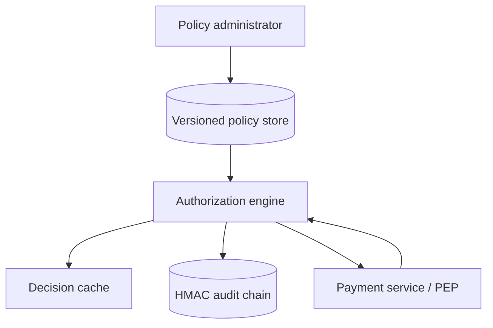

# Architecture

PolicyForge is a policy decision point (PDP). Protected services remain policy enforcement points (PEPs): they build a complete authorization request, ask PolicyForge, enforce the decision and its obligations, and deny if the PDP cannot provide a valid answer.

## Decision pipeline

1. Reject principal/resource tenant mismatch.
2. Resolve the immutable current policy version for the tenant.
3. Build a cache key from policy version and the complete decision context.
4. Match roles, action, resource, and bounded attribute conditions.
5. Apply deny-overrides combining semantics.
6. Merge obligations; conflicting values fail closed.
7. Cache the decision for a short bounded TTL.
8. Append the request identity and result to the authenticated audit ledger.
9. Return only after audit persistence succeeds.

## Trust boundaries

Policy administration and decision evaluation are distinct capabilities. A caller allowed to request a refund decision must not automatically be allowed to publish refund policy. In production, use separate authenticated endpoints or services and tenant-scoped administrator roles.

## Availability and failure behavior

Authorization is security-critical. A PEP must deny on timeout, malformed response, unknown obligation, or unavailable PDP unless a narrowly scoped, reviewed local emergency policy exists. PolicyForge itself fails the request when audit persistence fails rather than returning an unrecorded authorization.

## Scaling path

The reference process keeps current bundles and a bounded cache in memory while persisting policies and audit locally. A production design can distribute signed immutable bundles to many read-only PDP replicas, use per-replica caches, and stream audit records to an append-only centralized system. Bundle version remains part of every cache key and audit event.
